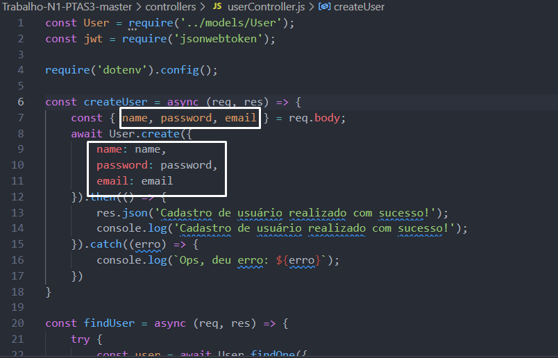
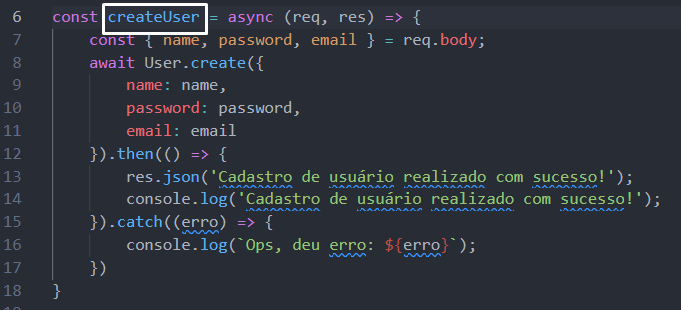

```md
# Guia de Configuração e Execução do Projeto

## 1. Configuração do Ambiente

### Passo 1: Configuração do Arquivo `.env`
Acesse a raiz do projeto e localize o arquivo `.env`. Nele, defina todas as informações necessárias para a conexão com o banco de dados PostgreSQL.

---

## 2. Configuração do Banco de Dados

### Passo 2: Ajuste do Model `User.js`
No diretório `models`, abra o arquivo `User.js` e substitua `db_user` pelo nome do seu banco de dados. Caso o banco de dados ainda não exista, o Sequelize irá criá-lo automaticamente.


---

## 3. Configuração dos Controllers

### Passo 3: Ajuste do `userControllers.js`
Edite o arquivo `userControllers.js`, localizado dentro do diretório `controllers`. Neste arquivo, você encontrará funções para:
- Cadastrar um usuário
- Listar um usuário
- Listar vários usuários
- Deletar um usuário
- Alterar um usuário

Substitua os atributos conforme a estrutura do seu objeto e do seu domínio de aplicação.



Altere também os nomes das constantes que recebem essas funções para refletirem seu escopo específico.



Além disso, renomeie os arquivos de acordo com a nomenclatura do seu projeto.

---

## 4. Configuração das Rotas

### Passo 4: Ajuste das Rotas
Acesse a pasta `routers` e:
1. Modifique os nomes das rotas para refletirem seu contexto.
2. Corrija a importação das funções, garantindo que os nomes correspondam às constantes definidas nos controllers.

---

## 5. Instalação e Execução

### Passo 5: Instalar Dependências
Na raiz do projeto, execute o seguinte comando para instalar os módulos necessários:
```sh
npm i
```

### Passo 6: Iniciar o Projeto
Após a instalação, inicie o projeto com:
```sh
npm start
```

O projeto estará rodando e pronto para uso!
```

